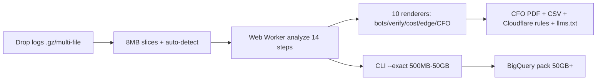

# Log File Bot Traffic Cost Analyzer

[](https://log-file-bot-traffic-cost-analyzer.pages.dev)
[](research/1gb-teardown.html)
[](data/bot-ips.json)
[](tests/)
[](guides/compare-screaming-frog-jetoctopus-free.html)
[](LICENSE)
[](https://github.com/dipakjad1993/Log-File-Bot-Traffic-Cost-Analyzer/actions)

Drop 1M-line logs → see **GPTBot vs OAI-SearchBot cost split** → copy the Cloudflare rule.
Free, private, **$0** vs $139/yr Screaming Frog Log Analyser ($279 Spider) / €171–383/mo JetOctopus (prices verified Feb 2026). No log leaves your machine.

**[Try Live](https://log-file-bot-traffic-cost-analyzer.pages.dev) · [1-click 10k demo](https://log-file-bot-traffic-cost-analyzer.pages.dev/?sample=10k) · [1GB proof teardown](research/1gb-teardown.html)**

> Private by design: 100% client-side, no XHR/WebSocket/sendBeacon. Only network request is loading the demo file you click. See [METHOD.md](METHOD.md).


<!-- TODO: record 15s demo.gif (drop 10k → KPI strip → copy Cloudflare rule → CFO PDF ↓) and place at assets/demo.gif, then swap first image. See ROADMAP.md P0. Mobile layout: assets/screenshots/25-mobile-hero.png -->

## 1. Proven on a real 1.02 GB / 3.2M-line log

Headless-Chromium run, 2026-09-11, `oneGB.jsonl` (seed 7). Systematic 1-in-10 sample, honestly bannered.

| Measurement | Result |
|-------------|--------|
| Read + parsed + analyzed | **320,000 of 3,200,000 lines in 6.6 s**, 13.0 s wall total |
| Records / bandwidth (sample) | 320,000 records, **10.92 GB**, 223,878 unique IPs |
| Traffic split | **70.0% human**, 15 categories detected |
| Cost, CloudFront defaults | **$2.61 total**, **$0.25 blockable** (training + suspicious only) |
| Response profile | avg 799 ms, P95 1,474 ms, P99 1,535 ms |
| Threats / verification flags | **19,272** suspicious, 427 unusual checks surfaced |
| Crawl-budget waste | 18% trap bandwidth quantified |

Full numbers + 29 screenshots: [research/1gb-teardown.html](research/1gb-teardown.html). Fixture: `npm run gen-logs -- --seed 42 --days 30` reproduces `sample-data/EXPECTED.md` byte-identically.

## 2. Why this exists (2026 position)

| Tool | Price 2026 | Scale | Privacy | When to use what |
|------|-----------|-------|---------|------------------|
| **This tool** | **$0** | Browser <500MB triage, CLI 500MB–50GB exact, BQ 50GB+ | 100% client-side | 30-sec answer, DPDP/RBI logs that can't leave the machine |
| Screaming Frog LFA | $139/yr (Spider $279/yr) | Desktop, slows past a few M lines | Local desktop | Mature docs, Spider × log joins |
| JetOctopus | €171–383/mo | Cloud millions, logs+crawl+GSC joined | Cloud upload | Continuous monitoring, history, client dashboards |
| OnCrawl / Botify | €49–2,500/mo | Up to 500M lines/day | Cloud + FTP | Enterprise SSO/procurement |
| Splunk | Custom ingest | Infinite | Cloud | Build-it-yourself DIY |

Honest take: paid tools win on continuity/history. This wins on privacy + speed + price. Details: [Frog vs JetOctopus vs $0](https://log-file-bot-traffic-cost-analyzer.pages.dev/guides/compare-screaming-frog-jetoctopus-free.html).

## 3. The 2026 distinction: training vs search-index vs user-triggered

Bot DB v2026.09.17, 127 signatures. Interviewers ask exactly this.

| Class | Examples | Edge action |
|-------|----------|-------------|
| **Training** | GPTBot, ClaudeBot, CCBot, Bytespider | Block/throttle freely, 60/min (20 aggressive) |
| **Search-index** | OAI-SearchBot, PerplexityBot, Claude-SearchBot | ALLOW 120/min, 429 + Retry-After only — never hard block |
| **User-triggered** | ChatGPT-User, Perplexity-User, OAI-AdsBot (allow-listed) | Do NOT throttle (300/min abuse ceiling only) |

Includes Cloudflare Sept-15-2026 defaults, Pay Per Crawl 402 beta, Web Bot Auth, vendor IP JSON (`data/bot-ips.json`, 14 sources, full CIDRs + IPv6). See [BOTS.md](BOTS.md).

## 4. The 10 modules (live demo, screenshots from 1GB run)

| # | Module | What you get |
|---|--------|--------------|
| 1 | Bot Classification | 127 sigs + 18 browser patterns, bot-first order, bandwidth/IPs/TTFB per category |
| 2 | Verification (4 layers) | Vendor IP JSON → TLS → cloud-ASN heuristic → behavior; UNVERIFIED spoof KPI, opt-in DoH rDNS |
| 3 | Crawl Budget + Render Gap | 16 traps (gclid, cart, `/_next/data/`) + JS-shell <5KB hunt (zero GEO citation chance) |
| 4 | Cost | Measured bytes × CDN preset, 95% interval, blockable = training + suspicious only |
| 6 | Edge Rules + Policy | Cloudflare/Fastly/AWS copy-paste, robots + llms.txt + crawlers.json bundle, OAI-AdsBot guard |
| 7–8 | Performance + Traffic | TTFB bots vs humans, bursts (z-score, no deps), 404-cluster tickets, GSC overlay |
| 9 | Security | Traversal, .git/HEAD, creds, SSRF, velocity anomalies |
| 10 | CFO / FinOps | Totals, monthly/annual run-rate, CSV + real PDF download (vendored jsPDF, no CDN) |

Screenshots: `assets/screenshots/09-tab1-classification.png` → `29-cfo-viewport.png`. Full history: [CHANGELOG.md](CHANGELOG.md).

## 5. Quick start

```bash
git clone https://github.com/dipakjad1993/Log-File-Bot-Traffic-Cost-Analyzer.git
cd Log-File-Bot-Traffic-Cost-Analyzer
node dev-server.js   # LOCAL DEV ONLY — http://localhost:8080. Never deploy to Pages.
# or: docker build -t log-analyzer . && docker run -p 8080:8080 log-analyzer
npm test             # 118 asserts
npm run lint
```

Inputs: JSON array, JSONL/NDJSON, Apache Combined, Nginx, W3C Extended (#Fields), AWS ALB, Cloudflare Logpush, .gz — mixed files + rotations OK. Streams in 8MB slices; 500MB+ exact → `node tools/cli.js --exact --in access.log --out summary.json`.

Deploy: Cloudflare Pages (primary, `main`, no build command, headers from `_headers`) or GitHub Pages backup. Live: https://log-file-bot-traffic-cost-analyzer.pages.dev

## 6. Method + honest limits

- **Cost = measured bytes × pricing.** Blockable = training + suspicious only (asserted in tests). Origin-compute OFF by default.
- **Verification = vendor IP JSON first**, heuristics labeled low-confidence, never verdicts. Sampling disclosed with stride/counts/timing.
- **Limits:** Browser <500MB triage (300k sampled) · CLI 500MB–50GB exact · BigQuery 50GB+. See [METHOD.md](METHOD.md).



## Docs

[BOTS.md](BOTS.md) · [METHOD.md](METHOD.md) · [ROADMAP.md](ROADMAP.md) · [BIGQUERY.md](BIGQUERY.md) · [sitemap.xml](sitemap.xml)

## Contributing / Security / License

[CONTRIBUTING.md](CONTRIBUTING.md) · [SECURITY.md](SECURITY.md) · MIT ([LICENSE](LICENSE)) — PRs welcome (`good first issue` labeled). If this saved you €383/mo, please star the repo.
